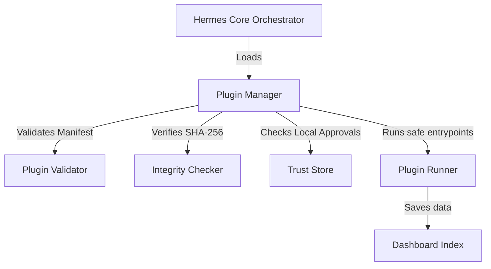

# 🪽 Hermes Agent Hub


A local-first dashboard to discover, validate and securely manage AI agents, Agent Skills and plugins on Windows.

---


## Key Features
*   🔍 **Agent Discovery:** Automatic background scanning of local AI agents, runtime details (Docker, CLI) and MCP servers.
*   📜 **Skills Validation:** Static structure analysis of `SKILL.md` instruction files (structural compliance scoring and high-risk command detection).
*   🔌  **Extensible Plugin Architecture:** Complete decoupled manager allowing custom plugins to run entrypoints and register results.
*   🛡️ **Safety Hardening:** Multi-layered verification system with builtin integrity baselines (SHA-256) and local user-approved trust stores.
*   📊 **Visual Dashboard:** Elegant local web interface showing agent lists, compliance audits, and plugin health.

---

## Installation in 3 Steps

1.  **Download the ZIP:** Download the compiled [hermes-agent-hub-v0.3.0-rc.1.zip](dist/hermes-agent-hub-v0.3.0-rc.1.zip) from our releases page.
2.  **Extract the Files:** Extract the archive content to a permanent local directory.
3.  **Check PowerShell 7+:** Ensure PowerShell Core (`pwsh`) is installed on your Windows machine. If not, install it using:
    ```powershell
    winget install Microsoft.PowerShell
    ```

---

## How to Run

Discharging master security scans and launching the local dashboard is unified in a single command. Open your terminal in the project directory and run:

```powershell
pwsh .\Start-HermesHub.ps1
```

---

## Plugin Architecture

The core of Hermes Hub is entirely decoupled from specific integrations. It acts as an orchestrator that loads, validates manifests, checks cryptographic signatures, and aggregates JSON results of enabled local plugins.



Included builtin plugins:
*   `agent-scanner`: Locates local AI agents and MCP servers.
*   `skills-scanner`: Discovers and scores `SKILL.md` instruction files.
*   `hello-plugin`: A disabled demo plugin showing how to register custom hooks.

---

## Security & Limitations

*   **No OS Sandbox:** Hermes Hub executes local plugin scripts in the same PowerShell process and with the same privileges as the logged-in user. **Always inspect third-party code before granting trust.**
*   **Permissions Metadata:** Declared permissions in `plugin.json` manifest are metadata descriptors. They serve for visualization and auditing purposes but do not enforce technical containment of system APIs.
*   **Offline Operation:** The platform runs completely off-line. There are no external telemetry endpoints, cloud synchronization hooks, or remote downloads.

---

## Supported Platforms

*   **Windows 10 / Windows 11** with PowerShell Core 7.0+ (Tested).
*   *Note: Linux and macOS support is planned but not officially validated in this release.*

---

## Roadmap
*   **v0.4.0:** Graphical settings editor in the Dashboard for `config.local.json`.
*   **v0.5.0:** Obsidian integration for reading vault notes and local semantic search (RAG).

---

## Contributing

We welcome community contributions! Please read [CONTRIBUTING.md](CONTRIBUTING.md) to understand our offline-first architecture, coding guidelines, and how to format pull requests.

---

## License

Distributed under the **MIT License**. See [LICENSE](LICENSE) for details.
