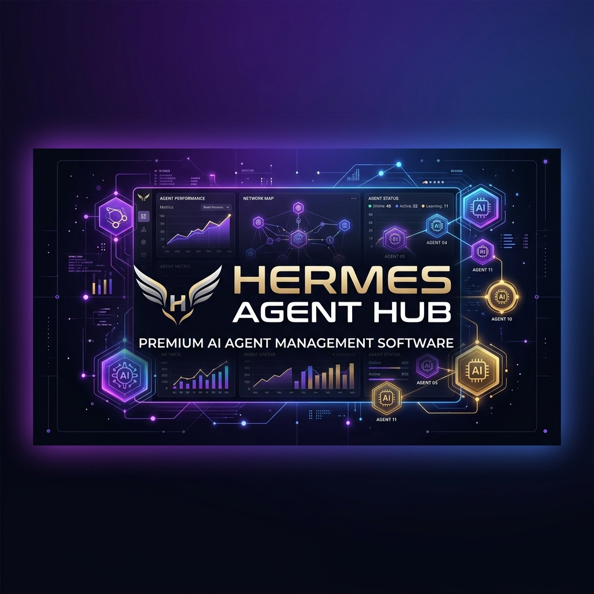
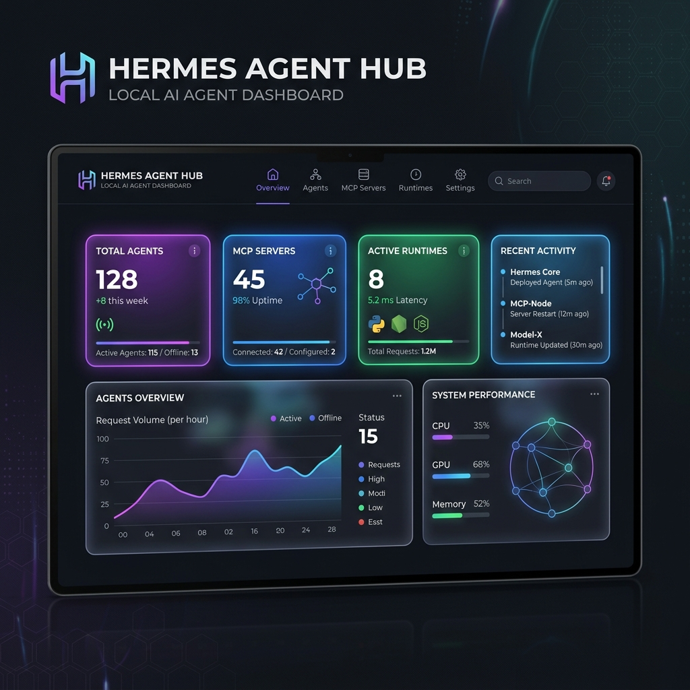
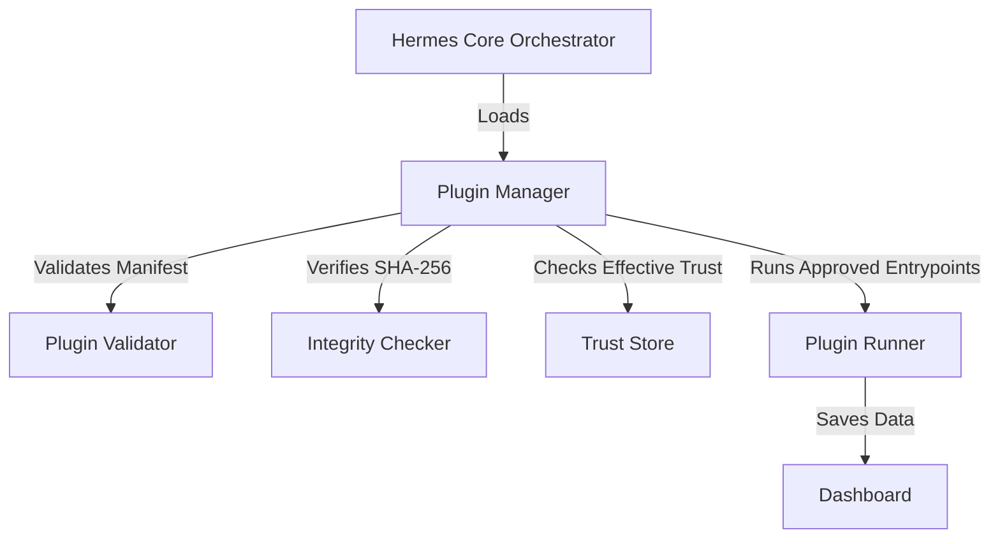

# 🪽 Hermes Agent Hub



A local-first dashboard to discover, validate and manage AI agents, Agent Skills and plugins on Windows with explicit trust and integrity checks.

> Hermes Agent Hub is an independent open-source project. It is not affiliated with or endorsed by NousResearch, Anthropic, OpenAI, Google, or the maintainers of the tools it detects.

[Português](README.pt-BR.md)

---



> Concept UI mockup — actual interface may differ.

## Key Features
* 🔍 **Agent Discovery:** Automatic local scanning of AI agents, runtime details, Docker-based services, CLI tools and MCP servers.
* 📜 **Skills Validation:** Static structure analysis of `SKILL.md` instruction files, including structural compliance scoring, broken-link checks and high-risk command detection.
* 🔌 **Extensible Plugin Architecture:** A decoupled manager that validates manifests, verifies integrity, checks effective trust and runs explicitly approved plugin entrypoints.
* 🛡️ **Security Hardening:** SHA-256 integrity baselines, local trust stores and blocking rules for disabled, untrusted or modified plugins.
* 📊 **Visual Dashboard:** A local web interface for agent inventories, skill validation results and plugin health.

---

## Installation in 3 Steps

1. **Download the ZIP:** Download [hermes-agent-hub-v0.3.0-rc.1.zip](https://github.com/schaedler6/hermes-agent-hub/releases/download/v0.3.0-rc.1/hermes-agent-hub-v0.3.0-rc.1.zip) from the GitHub Release.
2. **Extract the files:** Extract the archive to a permanent local directory.
3. **Check PowerShell 7+:** Ensure PowerShell Core (`pwsh`) is installed on Windows. If it is missing, install it with:

```powershell
winget install Microsoft.PowerShell
```

Release page: [v0.3.0-rc.1](https://github.com/schaedler6/hermes-agent-hub/releases/tag/v0.3.0-rc.1)

---

## How to Run

Open PowerShell 7 in the project directory and run:

```powershell
pwsh .\Start-HermesHub.ps1
```

To execute the validation suite:

```powershell
pwsh .\tests\Test-HermesHub.ps1
```

---

## Plugin Architecture

Hermes Agent Hub keeps its core decoupled from individual integrations. The core discovers plugins, validates their manifests, verifies SHA-256 integrity hashes, determines their effective trust level and aggregates the JSON results returned by enabled plugins.



Included builtin plugins:
* `agent-scanner`: Locates local AI agents and MCP servers.
* `skills-scanner`: Discovers and scores `SKILL.md` instruction files.
* `hello-plugin`: A disabled demonstration plugin that is discovered and validated but not executed by default.

---

## Security & Limitations

* **No OS Sandbox:** Hermes Agent Hub executes approved local plugin scripts in PowerShell with the privileges of the logged-in user. Always inspect third-party code before approving it.
* **Integrity Is Not a Signature:** SHA-256 verifies whether approved files changed. It does not prove authorship and is not a digital signature.
* **Permissions Are Policy Metadata:** Permissions declared in `plugin.json` are validated and displayed, but they do not technically restrict Windows APIs or operating-system capabilities.
* **Untrusted Plugins Are Blocked:** A plugin cannot make itself trusted through its own manifest. Effective trust is controlled externally by Hermes Agent Hub.
* **Local Operation:** The current builtin plugins are designed for local operation without telemetry, cloud synchronization or automatic remote plugin downloads.

See [SECURITY.md](SECURITY.md), [docs/SECURITY_MODEL.md](docs/SECURITY_MODEL.md) and [docs/TRUST_MODEL.md](docs/TRUST_MODEL.md).

---

## Supported Platforms

* **Windows 10 / Windows 11** with PowerShell Core 7.0+ — officially tested.
* Linux and macOS support is planned but not validated in this release.

---

## Roadmap
* **v0.4.0:** Graphical settings editor for `config.local.json`.
* **v0.5.0:** Optional Obsidian integration and local semantic search workflows.

See [ROADMAP.md](ROADMAP.md).

---

## Contributing

Contributions are welcome. Read [CONTRIBUTING.md](CONTRIBUTING.md) before opening a pull request.

---

## License

Distributed under the **MIT License**. See [LICENSE](LICENSE).
