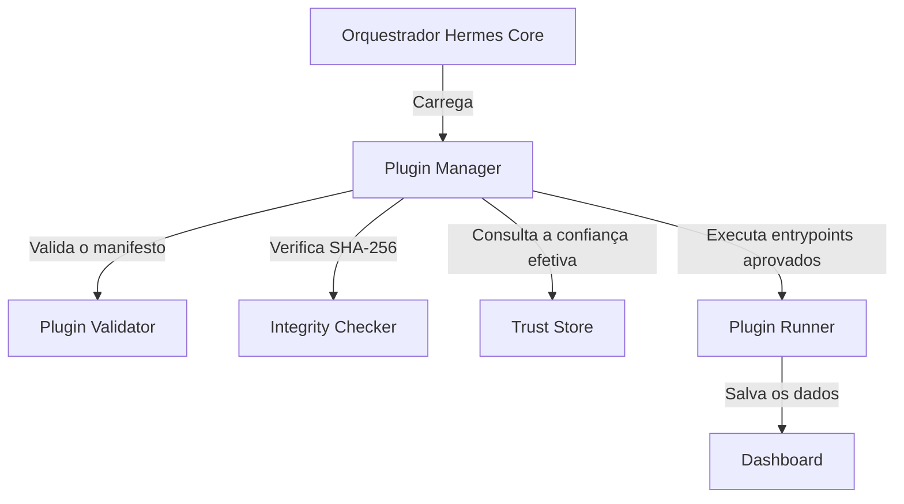

# 🪽 Hermes Agent Hub


Um dashboard local-first para descobrir, validar e gerenciar agentes de IA, Agent Skills e plugins no Windows com controles explícitos de confiança e integridade.

> O Hermes Agent Hub é um projeto independente de código aberto. Não possui afiliação nem endosso da NousResearch, Anthropic, OpenAI, Google ou dos mantenedores das ferramentas detectadas.

[English](README.md)

---


> Mockup conceitual da interface — a interface real pode apresentar diferenças.

## Funcionalidades principais
* 🔍 **Descoberta de agentes:** Varredura local de agentes de IA, runtimes, serviços em Docker, ferramentas de linha de comando e servidores MCP.
* 📜 **Validação de skills:** Análise estática de arquivos `SKILL.md`, com pontuação estrutural, verificação de links quebrados e detecção de comandos de alto risco.
* 🔌 **Arquitetura extensível de plugins:** Gerenciador desacoplado que valida manifestos, verifica integridade, consulta a confiança efetiva e executa somente entrypoints explicitamente aprovados.
* 🛡️ **Endurecimento de segurança:** Baselines SHA-256, trust stores locais e bloqueios para plugins desabilitados, não confiáveis ou modificados.
* 📊 **Dashboard visual:** Interface web local para inventários de agentes, resultados da validação de skills e integridade dos plugins.

---

## Instalação em 3 passos

1. **Baixe o ZIP:** Faça o download de [hermes-agent-hub-v0.3.0-rc.1.zip](https://github.com/schaedler6/hermes-agent-hub/releases/download/v0.3.0-rc.1/hermes-agent-hub-v0.3.0-rc.1.zip) na Release do GitHub.
2. **Extraia os arquivos:** Extraia o conteúdo para uma pasta permanente.
3. **Verifique o PowerShell 7+:** Confirme que o PowerShell Core (`pwsh`) está instalado no Windows. Caso não esteja, instale com:

```powershell
winget install Microsoft.PowerShell
```

Página da release: [v0.3.0-rc.1](https://github.com/schaedler6/hermes-agent-hub/releases/tag/v0.3.0-rc.1)

---

## Como executar

Abra o PowerShell 7 na pasta do projeto e execute:

```powershell
pwsh .\Start-HermesHub.ps1
```

Para executar a suíte de validação:

```powershell
pwsh .\tests\Test-HermesHub.ps1
```

---

## Arquitetura de plugins

O Hermes Agent Hub mantém o núcleo desacoplado das integrações individuais. O Core descobre plugins, valida seus manifestos, verifica os hashes de integridade SHA-256, determina o nível de confiança efetivo e consolida os resultados JSON retornados pelos plugins habilitados.



Plugins builtin incluídos:
* `agent-scanner`: Localiza agentes de IA e servidores MCP locais.
* `skills-scanner`: Descobre e avalia arquivos de instrução `SKILL.md`.
* `hello-plugin`: Plugin demonstrativo desabilitado, descoberto e validado, mas não executado por padrão.

---

## Segurança e limitações

* **Sem sandbox no sistema operacional:** O Hermes Agent Hub executa scripts locais aprovados no PowerShell com os privilégios do usuário conectado. Revise sempre o código de terceiros antes da aprovação.
* **Integridade não é assinatura digital:** O SHA-256 verifica se os arquivos aprovados foram alterados. Ele não comprova autoria e não constitui assinatura criptográfica.
* **Permissões são metadados de política:** As permissões declaradas em `plugin.json` são validadas e exibidas, mas não restringem tecnicamente APIs do Windows ou capacidades do sistema operacional.
* **Plugins não confiáveis são bloqueados:** Um plugin não pode tornar-se confiável por meio do próprio manifesto. A confiança efetiva é controlada externamente pelo Hermes Agent Hub.
* **Operação local:** Os plugins builtin atuais foram projetados para funcionamento local, sem telemetria, sincronização em nuvem ou download automático de plugins remotos.

Consulte [SECURITY.md](SECURITY.md), [docs/SECURITY_MODEL.md](docs/SECURITY_MODEL.md) e [docs/TRUST_MODEL.md](docs/TRUST_MODEL.md).

---

## Plataformas suportadas

* **Windows 10 e Windows 11** com PowerShell Core 7.0 ou superior — oficialmente testado.
* O suporte a Linux e macOS está planejado, mas não foi validado nesta release.

---

## Roadmap
* **v0.4.0:** Editor gráfico de configurações para `config.local.json`.
* **v0.5.0:** Integração opcional com Obsidian e fluxos locais de busca semântica.

Consulte [ROADMAP.md](ROADMAP.md).

---

## Contribuição

Contribuições são bem-vindas. Leia [CONTRIBUTING.md](CONTRIBUTING.md) antes de abrir um pull request.

---

## Licença

Distribuído sob a **Licença MIT**. Consulte [LICENSE](LICENSE).
