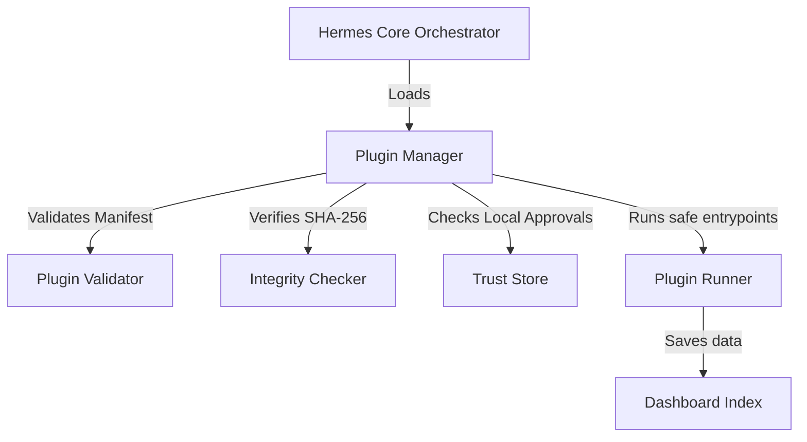

# 🪽 Hermes Agent Hub


Um dashboard local-first para descobrir, validar e gerenciar com segurança agentes de IA, Agent Skills e plugins locais no Windows.

---


## Funcionalidades Principais
*   🔍  **Descoberta de Agentes:** Varredura recursiva de agentes de IA locais ativos, detalhes de runtime (Docker, CLI) e servidores MCP locais.
*   📜 **Validação de Skills:** Análise de conformidade estática de arquivos `SKILL.md` (pontuação estrutural de diretrizes e detecção de comandos de risco).
*   🔌  **Arquitetura Extensível de Plugins:** Orquestrador desacoplado permitindo o carregamento e execução segura de plugins sem alterar o núcleo.
*   🛡️ **Endurecimento de Segurança:** Verificação criptográfica de hashes SHA-256 e controle local externo de trust stores (builtin, trusted, untrusted).
*   📊 **Dashboard Visual:** Interface web local responsiva e moderna apresentando inventários e logs das varreduras off-line.

---

## Instalação em 3 Passos

1.  **Baixar o ZIP:** Faça o download do arquivo compactado [hermes-agent-hub-v0.3.0-rc.1.zip](dist/hermes-agent-hub-v0.3.0-rc.1.zip) na nossa aba de releases.
2.  **Extrair os Arquivos:** Extraia o conteúdo do ZIP para um diretório permanente de sua escolha.
3.  **Verificar PowerShell 7+:** Garanta que possui o PowerShell Core (`pwsh`) no Windows. Caso contrário, instale-o via winget:
    ```powershell
    winget install Microsoft.PowerShell
    ```

---

## Como Executar

Disparar as varreduras de segurança e abrir o painel do Dashboard local é feito em uma única linha de comando. Abra o console na pasta do projeto e execute:

```powershell
pwsh .\Start-HermesHub.ps1
```

---

## Arquitetura de Plugins

O núcleo do orquestrador do Hermes Hub não conhece as implementações dos plugins individuais. Ele localiza as pastas, valida os manifestos, checa assinaturas SHA-256 e consolida os resultados JSON no Dashboard.



Plugins inclusos por padrão:
*   `agent-scanner`: Responsável por rastrear agentes de IA locais e servidores MCP.
*   `skills-scanner`: Responsável por rastrear e avaliar a conformidade de arquivos `SKILL.md`.
*   `hello-plugin`: Um plugin demonstrativo desabilitado exemplificando o registro de novos ganchos.

---

## Segurança e Limitações

*   **Sem Sandbox no SO:** Os scripts de plugins rodam na mesma sessão PowerShell do usuário ativo na máquina, compartilhando seus privilégios de sistema. **Revise todo código de terceiros antes de habilitar e aprovar.**
*   **Permissões Declaradas:** As permissões no manifesto `plugin.json` são metadados meramente descritivos para auditorias visuais, não representando restrições técnicas no nível do SO.
*   **Funcionamento Off-line:** O Hermes Hub não faz requisições externas à internet. Não há coleta de dados de telemetria, cookies ou conexões na nuvem.

---

## Plataformas Suportadas

*   **Windows 10 e Windows 11** utilizando PowerShell Core 7.0 ou superior (Testado).
*   *Nota: Suporte a Linux e macOS é planejado, mas não validado nesta release.*

---

## Roadmap
*   **v0.4.0:** Editor de configurações local interativo no Dashboard para o `config.local.json`.
*   **v0.5.0:** Integração com Obsidian para ler notas e skills associadas, com busca semântica off-line (RAG).

---

## Contribuição

Contribuições são super bem-vindas! Por favor, leia o documento [CONTRIBUTING.md](CONTRIBUTING.md) para compreender nossas diretrizes off-line, padrões de codificação e como formatar pull requests.

---

## Licença

Distribuído sob a **Licença MIT**. Consulte o arquivo [LICENSE](LICENSE) para obter detalhes.
