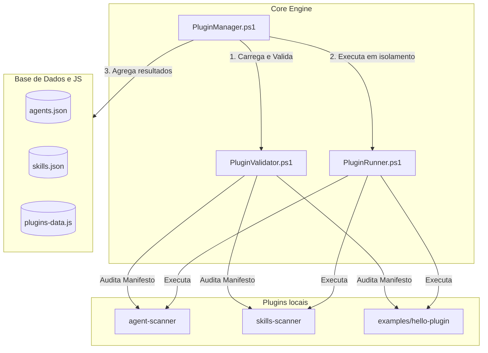

# 🏛️ Arquitetura de Plugins do Hermes Agent Hub

Esta documentação descreve a arquitetura extensível por plugins integrada no Hermes Agent Hub MVP v0.1.0, permitindo a descoberta de novas ferramentas locais sem alterações no núcleo.

---

## 1. Visão Geral da Arquitetura

O sistema é dividido em três camadas lógicas:
1.  **Core (Núcleo):** Orquestra a execução, valida permissões de segurança e agrega os relatórios gerados.
2.  **Plugins (Extensões):** Scripts PowerShell locais e independentes dotados de manifestos declarativos.
3.  **Dashboard (Visualização):** Interface em HTML/JS que apresenta os dados agregados de conformidade e integridade.

---

## 2. Fluxo de Carregamento e Execução

1.  **Leitura do config.json:** O inicializador lê a lista de diretórios autorizados (`pluginPaths`) e os IDs de plugins habilitados (`enabledPlugins`).
2.  **Descoberta:** O `PluginManager` localiza subpastas de plugins contendo manifestos `plugin.json` nos diretórios informados.
3.  **Validação Rígida:** O `PluginValidator` checa:
    *   Integridade de campos do JSON;
    *   Suporte a plataforma (`windows`);
    *   Existência do entrypoint declarado;
    *   Path Traversal (o entrypoint resolvido deve estar fisicamente contido dentro do diretório do plugin).
4.  **Execução Isolada:** O `PluginRunner` dispara o entrypoint (com timeouts estritos) capturando a saída. Se o plugin falhar ou disparar uma exceção, o Runner intercepta o erro e envelopa em um contrato padrão, prevenindo a quebra de outros plugins.
5.  **Geração e Injeção de Dados:** O `PluginManager` une os dados gerados de agentes, skills e metadados de plugins, exportando relatórios estruturados na pasta `data/` e nos payloads JavaScript locais da interface web.

---

## 3. Isolamento e Segurança de Execução

*   **Sandbox Sem Privilégios Elevados:** Plugins locais rodam exclusivamente no espaço de usuário comum.
*   **Controle de Acesso Físico:** Tentativas de caminhos relativos que apontem ou manipulem arquivos fora da pasta do próprio plugin são bloqueadas estaticamente na validação.
*   **Ausência de Conexões Externas:** Os plugins funcionam de forma 100% offline, sendo vetadas chamadas de rede ou downloads remotos.
